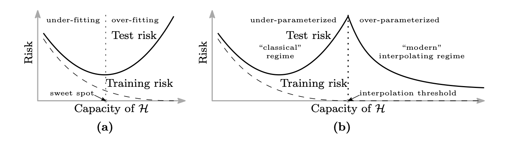

<style type="text/css">

body {
  font-family: serif;
  text-align: justify;
}

</style>

```{r setup, include = FALSE}
knitr::opts_chunk$set(
  message = FALSE, warning = FALSE, echo = FALSE, dpi = 500,
  fig.height = 4, fig.align = "center", comment = "#>",
  dev.args = list(png = list(type = "cairo"))
)
```

```{r lib, include = FALSE}
library(tidyverse)
library(patchwork)
library(rlang)
library(zoo)
r_source <- list.files("../R", full.names = TRUE)
map(r_source[str_detect(r_source, "\\.R$")], source)
```

```{r code, include = FALSE, cache = FALSE}
knitr::read_chunk("report.R")
```

# Introduction

## Background

Pneumonia is the deadliest infectious disease to children under the age of 5, responsible for 740,180 deaths under 5 as of 2019 [@WHO2022]. The worsening symptoms of pneumonia can rapidly become life-threatening for young children if not treated on time. Nevertheless, the early stage of pneumonia with young children is often confused with other less serious respiratory disease with similar symptoms. On the other hand, a medical institution cannot provide comprehensive monitoring to all its patients for all potential symptoms of pneumonia due to limitation of resources. Thus it is of interest to develop light-weight, non-evasive methods for detecting the most common symptoms of pneumonia, as an early warning to serve as an indication of a need for further medical interventions.

In a research outlined in @Shamoon2004, tachypnoea (average respiratory rate > 50 per minute) is one of the critical indicators of pneumonia in young children. However, the high volatility of breath rate in children poses a major challenge for manual counting that is both time-consuming and prone to error. In contrary, automated respiratory monitoring often involves machine-measurement of chest/abdomen movement or nasal airflow that are resource-costly and possibly invasive such that the discomfort from wearing the equipment might adversely affect its accuracy.

A potential solution to the problem above arises from the phenomenon of *respiratory sinus arrhythmia*, such that the instantaneous heart rates increase with inspiration and decrease during expiration [@Larsen2010], by monitoring the periodicity of variation in the heart rate, it may be possible to determine one's respiratory rate with a simple, non-evasive method, such as by a pulse oximeter that is resource-friendly. As such, this project attempts to develop an efficient *predictive* algorithm to accurately and precisely determine respiratory rate from heart rate, as well as briefly discuss its limitations and direction for future works.

## The data

The *apnea-ECG database* [@Penzel2000] on *PhysioNet* [@Goldberger2000] provides sufficiently large data sets of approximately eight hours long records of electrocardiogram and respiratory signals for eight subjects in a study for *sleep apnea*. The eight records consist of 100Hz signal from the electrocardiogram (ECG), respiratory effort from chest/abdomen movements, nasal airflow, and blood O$_2$ saturation over time.

A major concern of using such data is the misalignment of objective for the researches. Study for apnea typically involves subjects with airway obstruction, a factor that must be considered for prior to building our model. Under the presumption that, subjects in our data might sometimes stop breathing, the response variable of interest should be robust from the presence of apnea. Therefore, the model will focus on exploring the algorithm for determining the respiratory rate from the ECG signal as a predictor for the respiratory rate implied by chest movements, assuming that for living humans, respiratory efforts are always present.

This study will divide records from the eight subjects into two sets:

  - Subjects a01, a02, a03, a04 and b01 form the *training set*.
  - Subjects c01, c02 and c03 form the *test set* for evaluation.

# Methodologies and implementation

## Data wrangling

### Processing ECG signals

The ECG signal does not provide the heart rate directly. Instead, it is a time series of varying electric potential that controls the rhythm of the contraction and relaxation of the heart muscle, with a magnitude of approximately 0.5mV in absolute value. Such a signal is often masked by unwanted noise, such as electric signals from pectoral muscle movement, creating a challenge in computing heart rate from the ECG signal.

```{r ecg-noise, fig.height = 4.7, fig.cap = "Top: sudden spike in noise; bottom: frequency spectrum of the ECG signal"}
```

Cardio-activities are reflected in the ECG signal as time series of QRS complex as counts for complete heart beats [@Goldberger2017], where the instantaneous heart rates are determined by the interval of consecutive R-peaks, characterised by a positive crest in electric potential with a frequency of approximately 10--20Hz, and are distinguishable from P and T peaks with frequencies mostly below 5Hz.

Apart from muscle-induced electric noise, another challenge arises from abnormally peaked P and T waves from a variety of heart conditions (for example, abnormally peaked T waves observed on subject [a02](#visual)). Upon de-noising the ECG signal, it is also needed to suppress the peaks for P and T waves. Otherwise, they become less distinguishable from the R peaks amplitude-wise and might be mistakenly flagged as R peaks.

```{r qrs, fig.height = 3.2, fig.cap = "An example QRS complex from the ECG signal for one complete heart beat"}
```

Intuitively, the simplest method for reducing the noise and suppressing P and T peaks is to filter out their typical frequencies. With observed frequencies of noise from the frequency spectrum mostly above 20Hz, and the characteristic frequencies of P and T waves being below 5Hz, we may utilise the Discrete Fourier Transform (DFT) [@Cooley1965], to create a band-pass filter, retaining only 5--20Hz signals from the ECG data. The DFT transformed signal compromises the Nyquist frequency bins (with its range being half of sampling frequency) [@Nyquist1928] corresponding to each of the harmonic. The band-pass filtered signal is then obtained by applying the (normalised) inverse Discrete Fourier Transform to the DFT transformed signal, with zeroed frequency bins for 0-5 and 20-50Hz. For computational efficiency, the Discrete Fourier Transform is implemented by R [@R] with the Fast Fourier Transform (FFT) algorithm [@Single1979] using the already available `fft()` function [@Becker1988].

It is worth noting that, the DFT approach to band-pass filtering as per outlined above has not accounted for the modulation effect from Fourier Transform, and will likely cause phase shifts in the de-noised signals. Nevertheless, upon thorough inspection, the observed phase error in the filtered output are mostly within 10--20ms, and easily correctable with local peak-matching, which is discussed in the following paragraphs.

*Note: most "for loops" in the pseudocode algorithms in this report are implicitly implemented by vectorisation.*

\begin{algorithm}
\caption{5--20Hz band-pass filter with Discrete Fourier Transform}
\begin{algorithmic}[1]
\STATE Take $\mathbf{x} \in \mathbb{R}^n$ as the 100-Hz input
\STATE Obtain $\mathbf{y}$ by Discrete Fourier Transform on $\mathbf{x}$:
\FOR{$t = 1, ..., n$}
\STATE $y_t \leftarrow \sum_{k = 1}^n{x_k}\exp(-2\pi i(k - 1)(t - 1) / n)$
\ENDFOR
\STATE Zero corresponding (Nyquist) frequency bins for 0-5, 20-50Hz:
\FOR{$t = 1, ..., n \land (t \in (0.2n, 0.8n) \lor t > 0.95n \lor t < 0.05n)$}
\STATE $y_t \leftarrow 0 + 0i$
\ENDFOR
\STATE Obtain $\mathbf{z}$ by normalised inverse Discrete Fourier Transform on $\mathbf{y}$:
\FOR{$t = 1, ..., n$}
\STATE $z_t \leftarrow \sum_{k = 1}^n{y_k}\exp(2\pi i(k - 1)(t - 1) / n) / n$
\ENDFOR
\RETURN $\text{Re}(\mathbf{z}) \in \mathbb{R}^n$ as the 100-Hz output
\end{algorithmic}
\end{algorithm}

With the de-noised ECG signal, a special algorithm for timestamping the R peaks is developed based on logical check for local maxima and double thresholding. For the amplitudes of P and T peaks are suppressed in the filtered signal, the local maxima above certain threshold in the series are the R peaks. For a series of discrete-time signal, the local maxima are indicated by whenever the signs of the first difference change from *positive* to *negative*. Also, as the R peaks are more than triple the amplitude of the DFT suppressed P and T peaks, all local maxima with an amplitude of at least half (in prudence) the amplitude of previous peak are indicated as the R peaks. Upon implementation, the threshold is set at half of the rolling maxima for the last 101 ticks (1.01s). For extra caution to unlikely events when there is no heart beat in the past 1.01 seconds, a second threshold, the 95% empirical quantile of amplitude of the signal, is imposed. All time-points in the filtered ECG signal that are deemed as local maxima also with amplitude above the two thresholds are stamped as R peaks. The algorithm is fast even for long ECG signal.

There are, however, issues that cannot be dealt with via aforementioned algorithms. While the algorithms are robust against moderate noise with filtering, they will unlikely function in the presence of extreme noise with amplitude exceeding the original signal. Under such extreme noise, which is rarely seen, the stamped R peaks would manifest small clusters of abnormally short R-R intervals, typically below 300ms. Therefore, an additional check is implemented to identify and remove all the abnormal timestamps. Another issue with the algorithm is the phase shift induced by Fourier Transform. Without taking care for the modulation harmonics, the timestamps obtained from the filtered signal are $\pm10$--20ms away from the true observed R peaks in the original signal. Fortunately, the phase errors are small and can be easily corrected by searching for the existence of another peak around the neighbours in the original signal.

\begin{algorithm}
\caption{R peak timestamping with phase correction}
\begin{algorithmic}[1]
\STATE Take the original $\mathbf{x} \in \mathbb{R}^n$ and the filtered $\mathbf{z} \in \mathbb{R}^n$ as the 100-Hz inputs
\STATE Set moving threshold $\mathbf{b}$ as half of rolling maxima:
\STATE $(b_t | t = 1, ..., 100) \leftarrow (+\infty)_{\times 100}$ (rolling maxima is undefined for the first second, pad using $+\infty$)
\FOR{$t = 101, ..., n$}
\STATE $b_t \leftarrow \frac{1}{2}\max\{z_{t - 100}, ..., z_t\}$
\ENDFOR
\STATE Create thresholding Boolean $\boldsymbol{\iota^{(1)}}$:
\FOR{$t = 1, ..., n$}
\STATE $\iota^{(1)}_t \leftarrow I(z_t > \max\{b_t, F^{-1}_{Z}(0.95)\})$
\ENDFOR
\STATE Create local maxima Boolean $\boldsymbol{\iota^{(2)}}$:
\FOR{$t = 1, n$}
\STATE $\iota^{(2)}_t \leftarrow 0$ (local maxima are undefined for the boundaries)
\ENDFOR
\FOR{$t = 2, ..., n - 1$}
\STATE $\iota^{(2)}_t \leftarrow I[I(z_{t + 1} - z_t > 0) - I(z_t - z_{t - 1} > 0) = -1]$
\ENDFOR
\STATE Preliminary timestamps for R peak $\mathbf{p} \leftarrow (t = 1, ..., n | \iota^{(1)}_t \land \iota^{(2)}_t = 1 \text{ is True})$
\STATE Remove abnormal timestamps in $\mathbf{p}$ with R-R intervals of < 300ms
\STATE Correct phase-shifts caused by discrete Fourier Transform:
\FOR{$t \in \{\mathbf{p}\}$}
\STATE $p | p = t \leftarrow {\arg\max}_{i = t - 4, ..., t, ..., t + 4} x_i$
\ENDFOR
\RETURN $\mathbf{p}$ the timestamps of the R peak
\end{algorithmic}
\end{algorithm}

\newpage

### Heart rate derivation from ECG signals

Once all the time points of R peaks are identified, we have cleared all obstructions to determining the heart rate. At any point in time within the series of ECG signal, the instantaneous heart rate is determined by interval between the subsequent and consequent R peaks. While one might explicitly loop over all the $5 \times 3$ million data points in ECG to obtain the series of intervals between R peaks, the process can be more efficient via vectorisation. It can be shown, with an example, that the derived series of R-R interval as a function of series of timestamps of the R peaks, is equivalent to repeating the differenced timestamps each for numbers of times equalled to the differenced timestamps themselves.

*For example, the R peaks are on the 3rd, 7th, 10th and 12th time ticks (for illustration purpose only), then the series of R-R interval can be computed by the following R (R Core Team, 2023) code:*

```{r demo, echo = TRUE}
```

The series of instantaneous heart rate per minute is then obtainable by 60 $\times$ frequency $/$ R-R intervals.

\begin{algorithm}
\caption{Deriving instantaneous heart rates from R peak timestamps}
\begin{algorithmic}[1]
\STATE Take $\mathbf{p}$ the timestamps of the R peak as the input, and $\nu$ as an argument for the frequency unit of $\mathbf{p}$
\STATE $m \leftarrow \dim(\mathbf{p})$ dimension of $\mathbf{p}$
\STATE Compute the R-R intervals $\mathbf{d}$:
\STATE $(d_t | t = 1, ..., p_1) \leftarrow (\text{NA})_{\times p_1}$ (heart rate is undefined before the first R peak)
\STATE $(d_t | t = p_1 + 1, ..., p_{m}) \leftarrow ((p_2 - p_1)_{\times (p_2 - p_1)}, (p_3 - p_2)_{\times (p_3 - p_2)}, ..., (p_{m} - p_{m - 1})_{\times (p_{m} - p_{m - 1})})^\top$
\STATE Convert R-R intervals into heart rates per minute $\mathbf{h}$:
\STATE $\mathbf{h} \leftarrow 60 \cdot \nu / \mathbf{d}$
\RETURN $\mathbf{h}$ the heart rates per minute at frequency $\nu$
\end{algorithmic}
\end{algorithm}

The output series of instantaneous heart rate is a signal at 100Hz with stepped (quantised) values, as the resolution of the derived heart rate is limited by the sampling frequency of the ECG signal (see next page).

### Visualising ECG signal processing {#visual}

```{r ecg-process, fig.height = 9, fig.width = 7}
```

## Modelling rate of breathing by heart rate

As per phenomenon of *respiratory sinus arrhythmia* described in Larsen et al. (2010), we expect to observe a periodic variation in heart rates with chest movements while breathing. Therefore, the final objective is to develop an algorithm to accurately "count" the number of respiration from both heart rate variation and chest movements, and hence construct a model to predict the rate of respiration using heart rate alone.

### The smoothing spline crossing algorithm

An algorithm, which I name the smoothing spline crossing algorithm, was inspired by the idea of zero crossing [@Giannakopoulos2014], often used in audio processing for estimating the number of wave oscillations from the number of sign changes (when the signal has crossed the zero axis):

\begin{align*}
  \text{Z}(\mathbf{a}) \approx \frac{1}{2} \sum_{t = 2}^{\dim(\mathbf{a})} |\text{sgn}(a_t) - \text{sgn}(a_{t - 1})|
\end{align*}

For series with a nonzero mean, a generalisation to zero crossing is to count the oscillations by mean crossing:

\begin{align*}
  \text{Z}(\mathbf{a}) \approx \frac{1}{2} \sum_{t = 2}^{\dim(\mathbf{a})} |\text{sgn}(a_t - \bar{a}) - \text{sgn}(a_{t - 1} - \bar{a})|
\end{align*}

Nonetheless, the mean crossing estimate only works well if, and only if each oscillation almost always crosses the sample mean, e.g., an almost perfect sinusoidal wave. Yet the series of instantaneous heart rate and chest movement signals manifested oscillations with irregular cycles of nonstationary mean, such that a naive application of mean crossing will inevitably give a highly biased oscillation count. We thus need to find an alternative to sample mean for crossing for a better count of number of cycles for a nonstationary oscillation.

The smoothing spline [@Hastie1990; @Green1994] is a bivariate smoothing method based on regularised regression to a natural cubic spline basis, penalised by the integrated squared second derivative (which represents the roughness) of the smoothed curve, depictable as a function:

\begin{align}
  \mathbf{\hat{a}} = \hat{f}(\mathbf{t} ; \lambda) = \mathop{\arg\min}\limits_{f(\mathbf{t})} \Bigr\{||\mathbf{a} - f(\mathbf{t})||^2 + \lambda\int_t f''(s)^2ds\Bigr\} \text{ given any } \lambda > 0
\end{align}

Where $\lambda$ is the regularisation parameter controlling the penalty to the roughness of the fitted values, which effectively determines how smooth the fitted curve becomes. With *properly* selected $\lambda$, we are able to draw a better boundary for crossing, to give a better count for the oscillations, than the sample mean of the heart rates and chest movements. The proposed smoothing spline crossing method is given by:

\begin{align*}
  \text{S}(\mathbf{a} ; \lambda) &\approx \frac{1}{2} \sum_{t = 2}^{\dim(\mathbf{a})} |\text{sgn}(a_t - \hat{a}_t) - \text{sgn}(a_{t - 1} - \hat{a}_{t - 1})| \\
  &= \frac{1}{2} \sum_{t = 2}^{\dim(\mathbf{a})} |\text{sgn}(a_t - \hat{f}(t ; \lambda)) - \text{sgn}(a_{t - 1} - \hat{f}(t - 1 ; \lambda))|
\end{align*}

The smoothing spline fitting for heart rates and chest movements signal is implemented using R [@R] function `smooth.spline()` [@Chambers1992]. It uses the *B-spline*-equivalent to the natural cubic spline, a linear transformation of the spline basis to an orthonormal basis such that it gives the same smoothing curve, but numerically stabler in computation. The process of minimising the loss function in (1), numerically solving its first-order condition, is included in Algorithm 4 in matrix form.

It is noteworthy that the computational burden of the `smooth.spline()` function [@Chambers1992] arises from matrix computation for numerically solving the inverse of cross product for the *B-spline* basis, and such operation costs $O(\dim(\mathbf{a})^3)$ computation time. However, with our minutely-segmented approach (see the [next section](#mod-train) and Algorithm 5), number of data points in each of the segment is constant; and since the number of segments is proportional to $\dim(\mathbf{a})$, it reduces the computation time to $O(\dim(\mathbf{a}))$. Yet with over 15 million data points in the training set, the fitting process for the smoothing spline would still be unnecessarily slow, for considering the rate of breathing of an average child, a sampling frequency of 100Hz is redundantly high, for the purpose of capturing respiratory information. For this report, heart rates and chest movements signal is down-sampled to 1Hz immediately after filtering and prior to fitting. Note that, the selection of 1Hz is based on trial and not theoretically justified, but can be easily changed to another frequency if really necessary. Another practical reason for using 1Hz is that our subjects are adults. Further researches may study the adaptive selection of sampling frequencies, to best balance accuracy and efficiency.

\begin{algorithm}
\caption{Smoothing spline crossing for counting cycles of nonstationary pseudosinusoidal oscillations, for varying heart rates/chest movements}
\begin{algorithmic}[1]
\STATE Take a time series vector $\mathbf{a}$ at any frequency, and the optional argument $\lambda$ the regularisation parameter
\STATE $\mathbf{t} \leftarrow (1, ..., \dim(\mathbf{a}))^\top$ as the indexing vector
\STATE Construct B-spline bases $\mathbf{B}$ derived from natural cubic spline bases about all possible knots of $\mathbf{t}$
\STATE Penalty matrix $\boldsymbol{\Omega} \leftarrow \{\omega_{jk} = \int_t {B_j^{''}(s)B_k^{''}(s)}ds | B_j(t_i) = (\mathbf{B})_{ij}\}$
\IF{argument $\lambda$ is missing}
\STATE $\lambda \leftarrow {\arg\min}_{\lambda > 0} (1 - \text{tr}(\mathbf{B}(\mathbf{B}^\top\mathbf{B} + \lambda\boldsymbol{\Omega})^{-1}\mathbf{B}^\top) / \dim(\mathbf{a}))^{-2}||(\mathbf{I} - \mathbf{B}(\mathbf{B}^\top\mathbf{B} + \lambda\boldsymbol{\Omega})^{-1}\mathbf{B}^\top)\mathbf{a}||^2$
\ENDIF
\STATE $\mathbf{\hat{a}} \leftarrow \mathbf{B}(\mathbf{B}^\top\mathbf{B} + \lambda\boldsymbol{\Omega})^{-1}\mathbf{B}^\top\mathbf{a}$
\STATE Count the number of times the curves $(\mathbf{t}, \mathbf{a})$ and $(\mathbf{t}, \mathbf{\hat{a}})$ cross (equivalent to zero-crossing for $(\mathbf{t}, \mathbf{a} - \mathbf{\hat{a}})$)
\RETURN half of the count obtained above as the approximated cycles
\end{algorithmic}
\end{algorithm}

```{r sszc, fig.height = 3.2, fig.cap = "Subject a02's chest movement (top) and heart rates (bottom) at 1Hz for 1 minute. Blue: naive mean-crossing gives a count of 11.5 and 6 breaths; red: smoothing spline crossing gives a count of 19.5 and 16.5 breaths. We can clearly see that smoothing spline performs much better in counting breaths."}
```

### Model training {#mod-train}

The outlined algorithm for counting the number of oscillations in heart rates and chest movements signal is in fact a non-parametric predictive model, uniquely defined by the training data and the hyperparameter (as it is not directly involved in prediction) $\lambda$. As such, the main objective is to find the optimal value for $\lambda$.

The final model in this project attempts to predict "breaths per minute by chest movements" (denote $\mathbf{r}$) derived (by Algorithm 4) from the time series of "chest movements signal" (denote $\mathbf{c}$), with the "instantaneous heart rates" (denote $\mathbf{h}$). Thus ultimately, the optimal $\lambda = \hat{\lambda}_\text{opt}$ is found such that the derived (again by Algorithm 4) "breaths per minute from the heart rate" (denote $\mathbf{\hat{r}}$), as an estimator of $\mathbf{r}$, minimises

\begin{align*}
  ||\mathbf{r} - \mathbf{\hat{r}}||^2 = ||\mathbf{r} - \hat{f}(\mathbf{h}; \lambda)||^2 = ||\hat{f}(\mathbf{c}) - \hat{f}(\mathbf{h}; \lambda)||^2
\end{align*}

The observed and estimated counts are realised once per minute outlined as of below, the *core* of this project:

\begin{algorithm}
\caption{Deriving breath rate from heart rate based on chest movements}
\begin{algorithmic}[1]
\STATE Take $\mathbf{h}$ the heart rates per minute and $\mathbf{c}$ the chest movements signal (either at 100Hz or down-sampled) where both time series have aligned indices and identical frequency; and optional argument $\lambda_\text{opt}$ (only in model evaluation with test data)
\STATE For both $\mathbf{h}$ and $\mathbf{c}$, remove elements of index where $c_t = \text{NA}$
\FOR{each record of all the subjects}
\STATE Partition each of $\mathbf{h}$ and $\mathbf{c}$ into segments of 60-second data
\ENDFOR
\STATE Drop the remainder (last segment), which is less than 60 seconds
\IF{$\mathbf{h}$ and $\mathbf{c}$ for more than one subject is input}
\STATE Bind $\mathbf{h}$ and $\mathbf{c}$ of all subjects together
\ENDIF
\FOR{each 60-second segment of $\mathbf{c}$}
\STATE Pass each minute of $\mathbf{c}$ into Algorithm 4 (the smoothing spline crossing, without specifying $\lambda$) to compute the true rate of breath based on chest movements, and output $\rightarrow \mathbf{r}$
\ENDFOR
\IF{argument $\lambda_\text{opt}$ is missing}
\STATE $\lambda_\text{opt} \leftarrow {\arg\min}_{\lambda > 0} ||\mathbf{r} - \hat{f}(\mathbf{h}; \lambda)||^2$ where $\hat{f}$ is the Algorithm 4: applied on each minute of $\mathbf{h}$ given $\lambda$
\ENDIF
\STATE $\hat{\lambda}_\text{opt} \leftarrow \lambda_\text{opt}$: if its value is obtained by Step 14 $\hat{\lambda}_\text{opt}$ is the estimate of $\lambda_\text{opt}$ derived from the training data; otherwise, if $\lambda_\text{opt}$ is passed as an argument, then the purpose of this algorithm is model testing
\FOR{each 60-second segment of $\mathbf{h}$}
\STATE Pass each minute of $\mathbf{h}$ into Algorithm 4 (with argument of $\lambda = \hat{\lambda}_\text{opt}$) to compute the derived rate of breath from heart rate, and output $\rightarrow \mathbf{\hat{r}}$ which is the model's estimate of $\mathbf{r}$: the chest rate of breath
\ENDFOR
\RETURN data matrix $(\mathbf{r}, \mathbf{\hat{r}})$, a bivariate time series (minutely), $\mathbf{r} :=$ "count of breaths by chest movements (observations)" and $\mathbf{\hat{r}} :=$ "number of breaths derived by cardio-activities of that minute (fitted values)", and most importantly $\hat{\lambda}_\text{opt}$ the trained parameter for our final model!
\end{algorithmic}
\end{algorithm}

## Model diagnostics

The trained model implied that one's heart rate is useful for inferring the rate of breath, and the results are statistically significant based on the regularisation result. If there is null relationship between the heart rate and rate of breath, the trained model should have returned a *least-complex fit* such that $L_2$ loss function (cross-validated MSE) is minimised at large $\lambda$ and is monotonically decreasing. Hence, the obvious inverted bell curve exhibited by the regularised $L_2$ loss with one minimum gives evidence against a *null-model fit*.

```{r resid-check, fig.height = 3.2, fig.cap = "Left: the existence of residual trend, indicates a nonzero bias; right: visual representation of the bias-variance tradeoff via regularisation, the result indicates that the model is more useful than null model."}
```

Notwithstanding the model being shown useful for predicting the rate of breath using the heart rate, it gives biased estimates for predictions. For all *best linear unbiased estimators* (BLUE), such as *least square estimators*, residuals: $\mathbf{r} - \mathbf{\hat{r}}$, are orthogonal (therefore, independent) to the fitted values: $\mathbf{\hat{r}}$. But, the final model gives $\hat{\text{Corr}}(\mathbf{\hat{r}}, \mathbf{r} - \mathbf{\hat{r}}) = -0.3976376$ implying $\text{Bias}(\mathbf{\hat{r}}) = \mathbb{E}(\mathbf{\hat{r}}) - \mathbf{r} \neq \mathbf{0}$. Such bias is introduced intentionally due to regularisation to reduce variance of the estimator $\mathbf{\hat{r}}$. More comparatively:

\begin{align*}
  \text{BLUE }&\text{minimises Var} (\mathbf{\hat{r}}) \text{ subject to Bias} (\mathbf{\hat{r}}) = \mathbf{0} \\
  \text{Regularised estimator }&\text{minimises MSE} (\mathbf{\hat{r}}) = \mathbb{E}((\mathbf{r} - \mathbf{\hat{r}})^2) = \text{Var}(\mathbf{\hat{r}}) + \text{Bias}(\mathbf{\hat{r}})^2
\end{align*}

While BLUE has constraints $\text{Bias}(\mathbf{\hat{r}}) = \mathbf{0}$ (always aims for maximising accuracy first), it unwantedly inflates the variance of the estimator. Whereas regularised estimator appeals to the *bias-variance tradeoff* seeks to directly minimise the cross-validated prediction error (as a function of $L_2$ loss), that is decomposable to the sum of variance (imprecision) and bias-squared (inaccuracy) for any estimator [@Hastie2009]. It follows that, we relaxed the requirement of zero bias via introducing a small bias (sacrificed some accuracy) for a substantially larger drop in variance (massively improved precision) to achieve better predictive performance.

Despite prior anticipation of the bias being nonzero, it is of interest to test for its statistical and practical significance and see if it is acceptably low. For heart-rate-derived breath rate: $\mathbf{\hat{r}}$, as an estimator for breath rate based on chest movements: $\mathbf{r}$, we can draw a hypothesis test for $\mathbf{r} = \beta\mathbf{\hat{r}}$, and due to the linear nature in projecting the estimator (see Algorithm 4), we have the null and alternative hypotheses:

\begin{align*}
  &H_0: \text{The estimator } \mathbf{\hat{r}} \text{ is unbiased} \iff \beta = 1 \\
  &H_1: \text{The estimator } \mathbf{\hat{r}} \text{ is biased} \iff \beta \neq 1
\end{align*}

Therefore, under $H_0:$

\begin{align*}
  \frac{1}{\sigma^2}(1 - \hat{\beta})^\top\mathbf{\hat{r}}^\top\mathbf{\hat{r}}(1 - \hat{\beta}) &= \sigma^{-2}\mathbf{\hat{r}}^\top\mathbf{\hat{r}}(1 - \hat{\beta})^2 \\
  &\sim \chi_1^2 \\
  \text{where } \hat{\beta} &= (\mathbf{\hat{r}}^\top\mathbf{\hat{r}})^{-1}\mathbf{\hat{r}}^\top\mathbf{r}
\end{align*}

Which gives the Wald's statistic [@Wald1943]:

\begin{align*}
  W &= \hat{\sigma}^{-2}\mathbf{\hat{r}}^\top\mathbf{\hat{r}}(1 - \hat{\beta})^2 \\
  &= (\dim(\mathbf{r}) - 1) ||(\mathbf{1} - \mathbf{\hat{r}}(\mathbf{\hat{r}}^\top\mathbf{\hat{r}})^{-1}\mathbf{\hat{r}}^\top)\mathbf{r}||^{-2}\mathbf{\hat{r}}^\top\mathbf{\hat{r}}(1 - (\mathbf{\hat{r}}^\top\mathbf{\hat{r}})^{-1}\mathbf{\hat{r}}^\top\mathbf{r})^2 \\
  &= (\dim(\mathbf{r}) - 1) ||(\mathbf{1} - \mathbf{\hat{r}}(\mathbf{\hat{r}}^\top\mathbf{\hat{r}})^{-1}\mathbf{\hat{r}}^\top)\mathbf{r}||^{-2}(\mathbf{\hat{r}}^\top\mathbf{\hat{r}} - \mathbf{\hat{r}}^\top\mathbf{r})^2
\end{align*}

Applied to the results of our final model, we have the Wald's $p$-value $\mathbb{P}(\chi_1^2 > W) = 2.983174 \times 10^{-13}$, which provides a very strong evidence for the estimator $\mathbf{\hat{r}}$ being biased. However, a further assessment on the 95% asymptotic confidence interval of $\beta$, (0.9521173, 0.9724053), indicates the bias is acceptable.

# Conclusion and further research

## Model evaluation

Despite we have justified the *goodness of fit* for the model, that the heart rate is useful for predicting respiratory rate, model diagnostics based on the training results might give an optimistic estimate for the prediction error. Hence, to neutrally assess the predictive performance of the model, its predictive power shall be tested in a separate *test* data set (c01-03), via *root mean squared error of prediction* (RMSEP).

When estimated optimal value of the regularisation parameter $\lambda = 1.571851 \times 10^{-6}$ is used in the model and applied to the *test* data set, the RMSEP is approximately 5.49 breaths per minute (or 33.95% off the observed respiratory rate). Unfortunately but not surprisingly, it is difficult to, using cardio-activities alone, both *precisely* and *accurately* predict the respiratory rate using *classical* statistical methods. Nonetheless, the findings in this project delivered compelling evidence for the feasibility of respiratory rate prediction using heart rate as one of the predictors, and a direction for implementation.

A lack of information from the *training* data set is a major reason of the under-satisfactory predictive performance of the model. Despite the records are eight hours long at 100Hz each with approximately 3 million data points, the sufficiency in sample size is only useful for building a model robust to abnormal signal. However, merely five individuals are unlikely able to give an adequate generalisation for the population. As such, preferably, the model should be trained using random sample of at least hundreds (even thousands) of individuals, from target populations (children under 5), as a guidance for further researches in this topic.

## Extending the model

Another major factor responsible for the low predictive power is due to the limitations of the *classical* statistical regime. In the following sections, two possible extensions to the model are briefly discussed.

### Bayesian approach and random effects models

The model outlined in this report naively assumed *fixed effects*, such that there exists a single true transformation to map the predictors to fitted values. Contextually, we were claiming that, the relationship of heart rate and respiratory rate is the same for all individuals, and it is unaffected by other factors.

A Bayesian extension to our model into a *random effects model* is able to free us from the assumption of *fixed effects*, which helps us model for additional physiological factors such as weight. It is worth noting that Bayesian statistical learning involves posterior computation, that often relies on stochastic simulation such as Markov chain Monte Carlo, which is much more time-consuming to train than the current model.

### Deep learning and double descent

Deep learning with *artificial neural networks* gives another direction for further researches. The advantage of deep learning over *classical* statistics is that it pushes the model beyond *bias-variance tradeoff*. While for *classical* methods the effective number of parameters cannot exceed the training sample size, the model complexity of neural network is not restricted by its training sample. Notwithstanding for both deep learning and *classical* methods, the predictive power suffers whenever the effective parameter size grows toward the training sample size, the over-parameterisation in neural networks allows for a second descent in the loss curve (also referred to as risk curve), in a phenomenon called the *double descent* [@Belkin2019]. Such effect of *double descent* has only recently been shown by research in *convolutional neural network*, *residual neural network* and *transformers* [@Nakkiran2019].

```{r ddd, out.width = "100%", fig.cap = "Visualisation in Belkin et al. (2019): (a) Bias-variance tradeoff in classical methods. (b) Double descent loss curve from modern interpolating regime, potentially giving better predictions."}

```

## Open and reproducible research

The source files and data for reproducing the report, the output of the project and history of all edits are available at the GitHub repository [szmsu2011/comp90072](https://github.com/szmsu2011/comp90072).

\newpage

# Appendix: model training workflow, code and output

## Source code

The source codes for the functions used in the workflow are in the `.R` files at [/R](https://github.com/szmsu2011/comp90072/blob/main/R). Code presented in this Appendix involved self-defined functions and will not work outside this project environment, unless they are sourced from the aforementioned source code directory in the project repository:

```{r re-source, echo = TRUE, eval = FALSE}
```

## Data wrangling and signal processing

```{r data, echo = TRUE, eval = FALSE}
```

## Model training

```{r train, echo = TRUE, eval = FALSE}
```
```{r result, echo = TRUE}
```

## Model diagnostics

```{r diag, echo = TRUE}
```

## Model evaluation

```{r eval, echo = TRUE}
```

\newpage

# References
